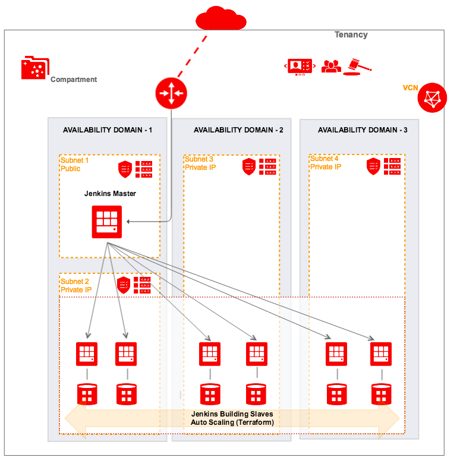

# oci-jenkins

These are Terraform modules that deploy [Jenkins](https://jenkins.io/) on [Oracle Cloud Infrastructure (OCI)](https://cloud.oracle.com/en_US/cloud-infrastructure).

## About
The Jenkins Oracle Cloud Infrastructure Module provides a Terraform-based Jenkins cluster installation for Oracle Cloud Infrastructure (OCI). Jenkins is a distributed automation server, generally associated with Continuous Integration (CI) and Continuous Delivery (CD). A Jenkins cluster typically involves one or more master instance(s) coupled with one or more slave instance(s).



## Prerequisites
1. Download and install Terraform (v0.10.3 or later)
2. Download and install the OCI Terraform Provider (v2.0.0 or later)
3. Export OCI credentials. (this refer to the https://github.com/oracle/terraform-provider-oci )
4. An existing VCN with subnets, and those subnets need internet access in order to download Java and Jenkins.


## What's a Module?
A Module is a canonical, reusable, best-practices definition for how to run a single piece of infrastructure, such as a database or server cluster. Each Module is created using Terraform, and includes automated tests, examples, and documentation. It is maintained both by the open source community and companies that provide commercial support.
Instead of figuring out the details of how to run a piece of infrastructure from scratch, you can reuse existing code that has been proven in production. And instead of maintaining all that infrastructure code yourself, you can leverage the work of the Module community to pick up infrastructure improvements through a version number bump.

## How to use this Module
Each Module has the following folder structure:
* [root](): This folder contains a root module calls jenkins-master and jenkins-slave sub-modules to create a Jenkins cluster in OCI.
* [modules](): This folder contains the reusable code for this Module, broken down into one or more modules.
* [examples](): This folder contains examples of how to use the modules.
  - [example-1](examples/example-1): This is an example of how to use the terraform_oci_jenkins module to deploy a Jenkins cluster in OCI by using an existing VCN, Security list and Subnets.
  - [example-2](examples/example-2): This example creates a VCN in Oracle Cloud Infrastructure including default route table, DHCP options, security list and subnets from scratch, then use terraform_oci_jenkins module to deploy a Jenkins cluster.

To deploy Jenkins Cluster servers using this Module:

```hcl
module "jenkins" {
  source              = "github.com/oci-quickstart/oci-quickstart-jenkins"
  compartment_ocid    = "${var.compartment_ocid}"
  master_ad           = "${var.master_ad}"
  master_subnet_id    = "${var.master_subnet_id}"
  slave_count         = "${var.slave_count}"
  slave_ads           = "${var.slave_ads}"
  slave_subnet_id     = "${var.slave_subnet_id}"
  ssh_authorized_keys = "${var.ssh_authorized_keys}"
  ssh_private_key     = "${var.ssh_private_key}"
}

```

Argument | Description
--- | ---
compartment_ocid | Compartment's OCID where VCN will be created
ssh_authorized_keys | Public SSH keys path to be included in the ~/.ssh/authorized_keys file for the default user on the instance
ssh_private_key | The private key path to access instance
label_prefix | To create unique identifier for multiple clusters in a compartment.
master_ad  | The Availability Domain for Jenkins master.
master_subnet_id | The OCID of the master subnet to create the VNIC in.
master_display_name | The name of the master instance.
master_image_id | The OCID of an image for a master instance to use. You can refer to https://docs.us-phoenix-1.oraclecloud.com/images/ for more details.
master_shape | The shape to be used on the master instance.
master_user_data | Provide your own base64-encoded data to be used by Cloud-Init to run custom scripts or provide custom Cloud-Init configuration for master instance.
slave_count | Number of slave instances to launch.
slave_ads | The list of Availability Domains for Jenkins slave.
slave_subnet_ids | The list of Jenkins slave subnets' id.
slave_display_name | The name of the slave instance.
slave_image_id | The OCID of an image for slave instance to use. You can refer to https://docs.us-phoenix-1.oraclecloud.com/images/ for more details.
slave_shape | The shape to be used on the slave instance
http_port | The port to use for HTTP traffic to Jenkins.
jnlp_port | The Port to use for Jenkins master to slave communication between instances.
plugins | The list of plugins to pre-install on the master instance.
